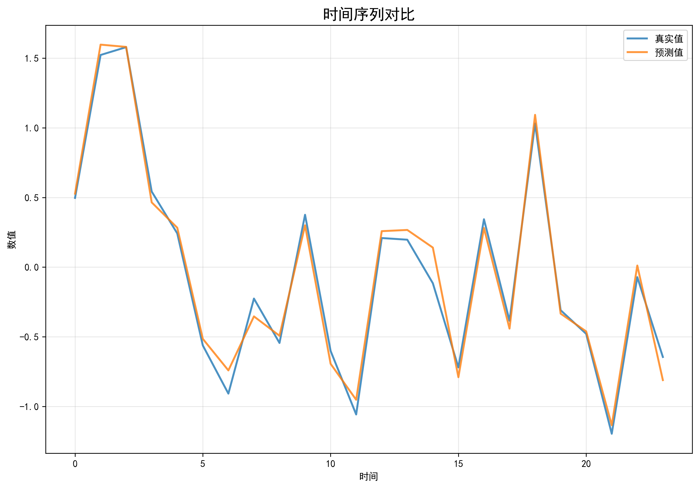

# 📖 Informer-Learn 💩山代码

> 一次小小的温习试水，却把整座「屎山」开源给你。  
> 代码能跑，图能看，R² 能到 0.8——剩下的，交给你继续堆高。

---

## 🌟 为什么又造一次轮子？

官方 [Informer2020](https://github.com/zhouhaoyi/Informer2020) 只有 Jupyter，  
而我习惯 `.py` 分步写、AI 辅助、B 站刷课（https://www.bilibili.com/video/BV19j421o7Xq?vd_source=3640a3e1c3b2025021fee39d67dddf7a）——  
于是把「看、学、踩坑、调参」全部揉进这份 repo，  
让后来者**少踩一个坑，多睡一个觉**。（当然矩阵调节让我崩溃）

---

## 🧪 实验快照（选择6轮+早停）

| 轮次 | R² (训练) | R² (测试) | 备注                         |
| ---- | --------- | --------- | ---------------------------- |
| 6    | 0.80      | 0.77      | 早停偷懒                     |
| 30   | 0.81      | 0.45      | 不早停卷到底（最不行的一次） |

> 数据：ETTh1 电力变压器小时级记录  
> 模型：官方 Informer 无阉割  
> 指标：无脑 R² + 可视化 
>
> 代码：我代码是30轮+不早停

---

## 🚀 一键起飞（也可能起飞不了，机长）

```bash
# CPU 也能跑，10 轮先试水
    # ========== 训练 ==========
    parser.add_argument('--batch_size', type=int, default=64)
    parser.add_argument('--train_epochs', type=int, default=10)          # 10轮
    parser.add_argument('--learning_rate', type=float, default=0.0001)
    parser.add_argument('--loss', type=str, default='mse')
    parser.add_argument('--lradj', type=str, default='type1')
    parser.add_argument('--patience', type=int, default=999)             # 禁用早停
```

想看 168 h 长期预测？把 `pred_len` 拉到 168 即可：

```bash
    # ========== 序列长度 ==========
    parser.add_argument('--seq_len', type=int, default=96)
    parser.add_argument('--label_len', type=int, default=48)
    parser.add_argument('--pred_len', type=int, default=24)
    # seq_len：Encoder 的「视野」
    # label_len：Decoder 的「起始令牌」
    # pred_len：最终要输出的「未来步数」
```

---

## 📊 可视化大礼包

- **单个对比时序图**：主要看
- **预测结果详细对比图**，多方位对比
- **预测误差分析**：直方图，置信区间，真实VS预测，误差热图

跑完直接拖进 PPT，老板都说low。

---

## 🧱 屎山结构

```
.
├─ 文档/  
│  ├─ Informer_ 20231116_144301.pdf         # B站教程pdf
│  └─ Informer.pdf                          # B站教程pdf副本
├─ checkpoints                            
│  ├─ checkpoint.pth                        # 6轮+早停
│  └─ Informer.pdf                          # B站教程pdf副本
├─ ETDataset                                # 官方数据            
├─ Informer2020                             # 官方代码
├─ results/   # 6轮+早停
│  ├─ data/                                 # CSV & 指标摘要
│  └─ png/                                  # 可视化图
├─ results/   # 30轮+不早停
│  ├─ data/                                 # CSV & 指标摘要
│  └─ png/                                  # 可视化图
├─ exa_informer.py                          # 主训练脚本
├─ Informer.zip                             # 官方代码压缩包
├─ exa_informer.py                          # 可视化脚本
└─ README.md                                # 你正在看的
```

---

## 📈 性能速览（6轮+早停）

📈 轮次 1 完成 | 训练损失: 0.4566460 | 验证损失: 0.8116358 | 训练R²: 0.5405

📈 轮次 2 完成 | 训练损失: 0.2910265 | 验证损失: 0.6295484 | 训练R²: 0.7066

 📈 轮次 3 完成 | 训练损失: 0.2334529 | 验证损失: 0.6222481 | 训练R²: 0.7647

📈 轮次 4 完成 | 训练损失: 0.2101262 | 验证损失: 0.6493709 | 训练R²: 0.7982

📈 轮次 5 完成 | 训练损失: 0.1977280 | 验证损失: 0.6463259 | 训练R²: 0.8012

> 基本10轮也可以试试，应该还能涨0.2左右。

---

### ✅ 可视化误差效果预览

**6轮+早停**

| 步骤             | 输出可视化图                              |
| ---------------- | ----------------------------------------- |
| 时间序列对比     |      |
| 预测结果详细对比 |  |
| 预测误差分析图   |      |

---

## 🛠️ 环境清单

- Python = 3.6

- conda激活环境（镜像源）随便下

- 中文字体：SimHei（Windows 自带）

- Package             Version
  ------------------- ------------
  certifi             2021.5.30
  colorama            0.4.5
  cycler              0.11.0
  dataclasses         0.8
  importlib-resources 5.4.0
  joblib              1.1.1
  kiwisolver          1.3.1
  matplotlib          3.3.4
  numpy               1.19.5
  pandas              1.1.5
  Pillow              8.4.0
  pip                 21.2.2
  pyparsing           3.1.4
  python-dateutil     2.9.0.post0
  pytz                2025.2
  scikit-learn        0.24.2
  scipy               1.5.4
  seaborn             0.11.2
  setuptools          58.0.4
  six                 1.17.0
  threadpoolctl       3.1.0
  torch               1.10.1+cu102
  torchaudio          0.10.1+cu102
  torchvision         0.11.2+cu102
  tqdm                4.64.1
  typing_extensions   4.1.1
  wheel               0.37.1
  wincertstore        0.2
  zipp                3.6.0

---

## 🤝 如何贡献

1. Fork
2. 堆你的屎山
3. Pull Request
4. 一起让山更高，让人看到就远离

---

## 📄 许可证

MIT · 随便改 · 随便商用 · 记得留名（不留也行，万一我出门了，这就是我黑历史）

---

> **最后一句**  
> 代码能跑，图能看，R² 能到 0.8——  
> 剩下的，交给你继续堆高。  
> 祝你玩得开心，睡得香甜。
